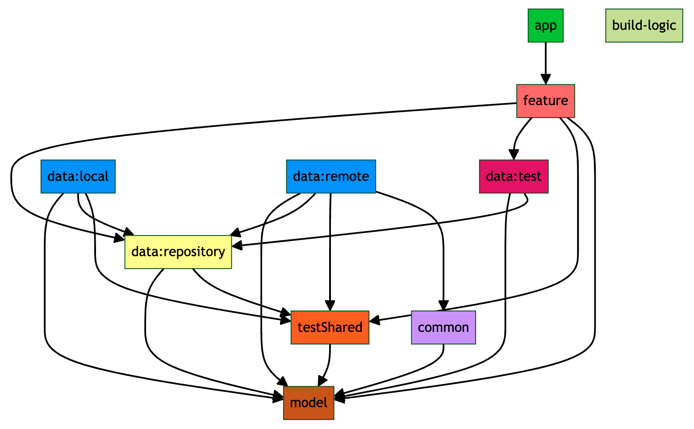

MoviesApp
=========

**MoviesApp** is an Android app built entirely with Kotlin and Jetpack Compose. It is is a
reinterpretation of the [Now In Android](https://github.com/android/nowinandroid) app, which is an
application developed by Google following Android design and development best practices and it is
intended to be a useful reference for developers.

## Features

**MoviesApp** displays content from the [TMDb](https://www.themoviedb.org/). Users can see the
current most popular movies. They can also search for any movie and access its
details. The last searched movies will be saved in the history to facilitate later searches.

## Screenshots

## Languages, libraries and tools

* [Kotlin](https://kotlinlang.org/)
* [Jetpack Compose](https://developer.android.com/develop/ui/compose)
* [Coroutines](https://developer.android.com/kotlin/coroutines)
* [Flow](https://developer.android.com/kotlin/flow)
* [Hilt](https://dagger.dev/hilt/)
* [Room](https://developer.android.com/topic/libraries/architecture/room.html)
* [Retrofit](http://square.github.io/retrofit/)
* [OkHttp](http://square.github.io/okhttp/)
* [Kotlin Serialization](https://kotlinlang.org/docs/serialization.html)
* [Coil](https://coil-kt.github.io/coil/)
* [MockK](https://mockk.io/)
* [Turbine](https://github.com/cashapp/turbine)
* [MockWebServer](https://github.com/square/okhttp/tree/master/mockwebserver)
* [Robolectric](http://robolectric.org/)

## Requirements

* JDK 17
* [Android Studio](https://developer.android.com/studio/index.html)
* Android 14 ([API 34](https://developer.android.com/studio/releases/platforms))
* Latest Android SDK Tools and build tools.
* Set [TMDb API key](https://developer.themoviedb.org/) in secrets.defaults.properties file.

## Architecture

The app architecture has been developed following the
official [architecture guidelines](https://developer.android.com/topic/libraries/architecture/index.html).
The app architecture is an adaptation of **Model-View-ViewModel (MVVM)** pattern which is a widely
used architectural pattern in software development, particularly popular in Android development. You
can find

### Data Flow:

The data flow in MVVM is typically unidirectional:

- **User Interaction:** The user interacts with the View (e.g., clicks a button).

- **View Triggers ViewModel:** The View notifies the ViewModel about the user interaction.

- **ViewModel Updates Model:** The ViewModel updates the Model based on the user interaction.

- **Model Notifies ViewModel:** The Model notifies the ViewModel about data changes (e.g., using
  LiveData or StateFlow).

- **ViewModel Updates View:** The ViewModel updates its UI state, which the View observes and uses
  to update the UI.

### Key Components:

- **Model:** Represents the data and business logic of your application. It's responsible for
  fetching, storing, and manipulating data, and it exposes this data to the ViewModel.

- **View:** Represents the UI (User Interface) of your application. It's responsible for displaying
  data to the user and handling user interactions. The View observes changes in the ViewModel and
  updates the UI accordingly.

- **ViewModel:** Acts as an intermediary between the Model and the View. It holds the UI state,
  prepares data for display, and handles user interactions by communicating with the Model. The
  ViewModel doesn't have direct knowledge of the View.

### Benefits:

- **Separation of Concerns:** Clearly separates UI logic (View), business logic (Model), and UI
  state management (ViewModel).

- **Improved Testability:** Each component can be tested independently, making it easier to write
  unit tests.

- **Maintainability:** The modular structure makes the code easier to understand, modify, and
  maintain.

- **Enhanced Collaboration:** Different team members can work on different components (designers on
  View, developers on Model and ViewModel) without interfering with each other.

## Modularization

**MoviesApp** has been fully modularized adapting guidances and modularization strategies
recommended by Google to achieve the following benefits:

- **Scalability:** In a tightly coupled codebase, a single change can trigger a cascade of
  alterations. A properly modularized project will embrace the separation of concerns principle.
  This in turn empowers the contributors with more autonomy while also enforcing architectural
  patterns.

- **Enabling work in parallel:** Modularization helps decrease version control conflicts and enables
  more efficient work in parallel for developers in larger teams.

- **Ownership:** A module can have a dedicated owner who is responsible for maintaining the code and
  tests, fixing bugs, and reviewing changes.

- **Encapsulation:** Isolated code is easier to read, understand, test and maintain.

- **Reduced build time:** Leveraging Gradle’s parallel and incremental build can reduce build times.

- **Dynamic delivery:** Modularization is a requirement for Play Feature Delivery which allows
  certain features of your app to be delivered conditionally or downloaded on demand.

- **Reusability:** Proper modularization enables opportunities for code sharing and building
  multiple apps, across different platforms, from the same foundation.

### Modules present in app:

- **App:** This is the main module of the application. It acts as the central hub, serving as the
  entry point and providing access to components from other modules to create a functional and
  cohesive Android application. By depending on the rest of the modules, it can access the necessary
  functionality and resources to build and run the app. This module also contains the app navigation
  logic.

- **Feature:** Feature modules contains all user-facing components, divided into modules for movies,
  search, and detail. Each feature module uses MVVM architecture, with ViewModels utilizing Use
  Cases to fetch data and create UI states. The View observes the UI state stream and renders the
  content accordingly. The UI state is designed as a sealed interface with a State (Loading,
  Success, Error) for easy composition. The application does not have a domain module because the
  use cases only act as a proxy for requests to the repository and it is considered that there is no
  need to move them by the moment to an external module following the strict definition proposed by
  Clean Architecture.

- **Data:** Data module is our access point to external data layers and is used to fetch data from
  multiple sources (cache and network).

- **Data - Respository:** Use Case classes will use a repository interface which defines the set of
  operations which can be performed within the data layer. This interface is the implemented by a
  Data Repository class which will use an instance of a Data Source Interface to retrieve data from.
  This Data Source Interface will be implemented by an external layer and allows us to abstract the
  source of data from our data layer - allowing us to create a more flexible and decoupled data
  source.

- **Data - Remote:** Remote module handles all communications with remote sources, in our case it
  makes simple API calls using a Retrofit interface. This service will be used within a Remote Data
  Source implementation class to retrieve instance of the Remote Model representations - this data
  store class implements the data store interface from the data layer. The data source class uses a
  model mapper that will map these remote models to the model representation found within the Model
  module.

- **Data - Local:** Local module handles all communication with the local database which is used to
  cache data. For this our Database should use the Room architecture component library for the data
  base, whos data is accessed using DAO classes from said library. The cache layer will have it's on
  Local Model representations which will be retrieved using the DAOs through the Local Data Source
  implementation class, which implements the data source interface from the data layer. This data
  source class will use a model mapper that will map these Cache models to the model representation
  found within the Model module.

- **Data - Test:** This module contains fake interface implementations of the Data module to be used
  in integration tests of the feature modules.

- **Model:** It has the domain models used by the rest of the app's modules from the time they are
  mapped in the datasources until they are presented in the feature modules.

- **Common:** This module has common classes and utilities used by other modules, such as UI
  components, icons and themes.

- **TestShared:** Test shared module contains common test classes and utilities used by other
  modules such as test rules, Hilt runner and semantic interactions used in UI tests.

- **Build-logic:** This module (often named :buildSrc) serves as a centralized location to manage
  custom build logic, scripts, and plugins that are shared across multiple modules in your project.
  It helps to organize the build process, promoting consistency and reducing code duplication.

You can see the dependency graph for all modules in the following images:

The dependencies of each module are represented by arrows pointing to the module
on which they depend.

## Testing

In order to provide examples of different testing strategies, several types of tests have been
implemented in the application, such as unit tests using mocks, ViewModels and repositories
integration tests using test doubles (fakes), datasources integration tests with Roboelectric, UI
unit tests and UI end to end tests with Compose. You can run all the tests executing the following
commands:

- `./gradlew test` run all local tests
- `./gradlew :app:connectedAndroidTest` run all instrumented test. All instrumented tests are
  located in app module.
